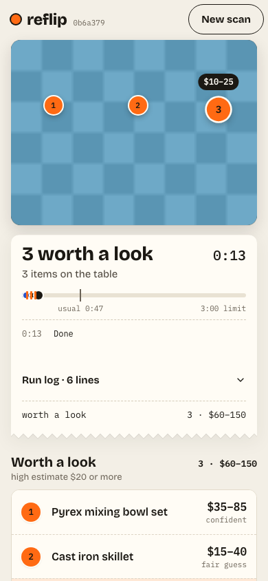
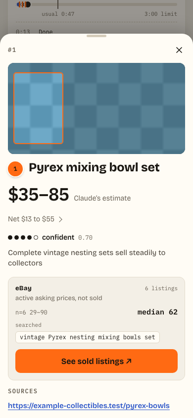
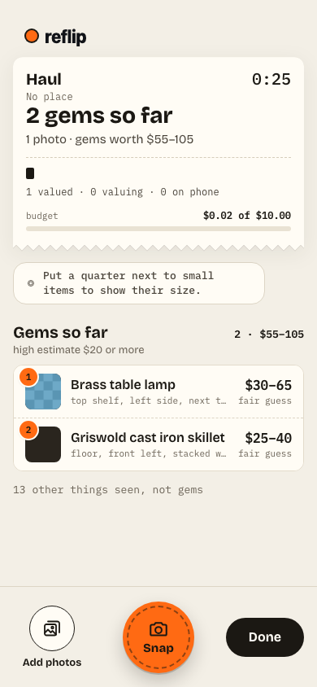

# reflip

reflip is the brain and the phone page behind Flip Scout, a personal tool that values items for
resale. Take one photo, and it replies with each sellable item's name, a resale estimate from
Claude, and matching eBay active-listing stats.





<sub>Screens come from fixture mode (`FIXTURES=1`): a generated test photo and recorded replies, not a live scan.</sub>

## Run it

```sh
npm install
npm run build
npm test
FIXTURES=1 PORT=8787 npm start
```

Then open `http://127.0.0.1:8787/` on a phone (or a browser at a narrow width) and take a photo, or
send the sample photo from another shell:

```sh
curl -s -X POST --data-binary @tests/fixtures/table.jpg -H 'content-type: image/jpeg' http://127.0.0.1:8787/api/scene
```

## Develop the page

```sh
npm run dev       # rescript build -w, in one shell
npm run dev:web   # vite, in another — proxies /api to the brain on :8787
```

Vite only proxies `/api`. It does not start the brain. Start the brain first, in its own shell:
`FIXTURES=1 PORT=8787 npm start` (or with real keys, see `CLAUDE.md`).

See `CLAUDE.md` for the hard design rules, the pricing table, and how the secrets load.

## M1 lite, not built yet

M1 records what each find cost and what it sold for, and measures Claude's ranges against those
sales. It needs no eBay access. The spec is [`docs/spec-lite-m1.md`](docs/spec-lite-m1.md).
[`docs/spec-budget.md`](docs/spec-budget.md) builds on it and replaces its Finds view, so that spec
must change to match before the build.
